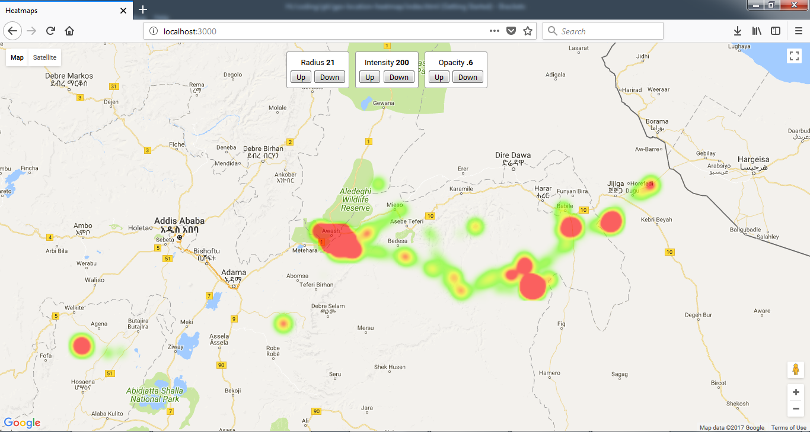

# gps-location-heatmap
Get the heatmap based on Google Location History information

- https://codeburst.io/how-i-created-a-heatmap-of-my-location-history-with-javascript-google-maps-972a2d1be240

**Todo**
- ~~Let's plan to complete it by Dec 23rd, 2017~~
- This version turnedout to be a static version, a better dynamic version is found at below and i do not think its using Google Maps, yay! https://github.com/theopolisme/location-history-visualizer

